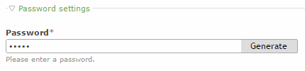

# Contao Password Suggestion

This extension adds a one-click password generator to the Contao Open Source CMS backend. It enhances the password widget in the user and member module as well as the personal data module. The next time you add a user or member you can simply generate a random password. Supports 4.13 LTS.



```
## Install ##
Just install the extension with Composer or with the help of the Contao Manager.

```bash

composer require presprog/contao-password-suggestion

```

## Config ##
You may configure the character set from which the password will be generated as well as its length.

```yml
// /config/config.yml

password_suggestion:
    characters: 'abcdefghijklnmnopqrstuvwxyz1234567890'
    password_length: 32
```

Made with ♥️ and ☕ by [Present Progressive](https://www.presentprogressive.de)
