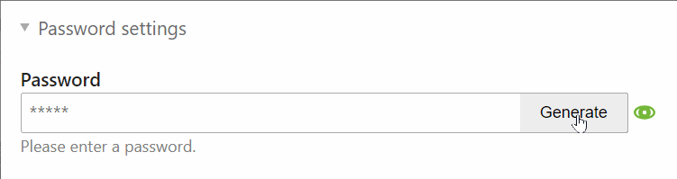

# Contao Password Suggestion

This extension adds an one click password generator to the Contao Open Source CMS backend. It enhances the password widget in the user and member module as well as the personal data module. The next time you add a user or member you can simply generate a random password.



## Config ##
This extensions respects the minimum password length defined in the configuration array (Contao sets a minimum of 8 characters). You may overwrite it in your localconfig.php:

```php

// localconfig.php
$GLOBALS['TL_CONFIG']['minPasswordLength'] = 16;

```
